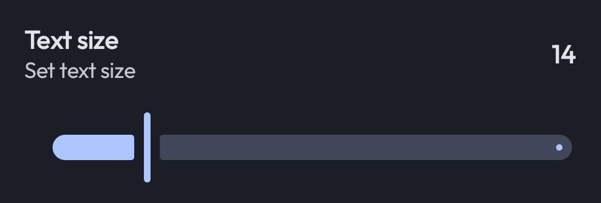
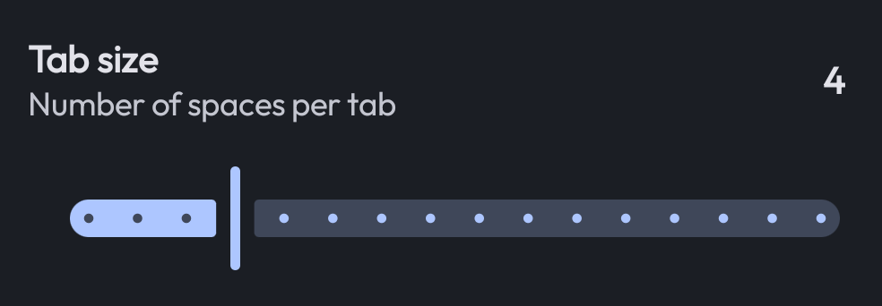
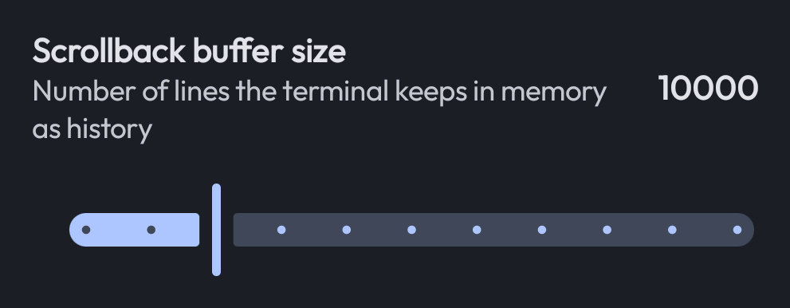
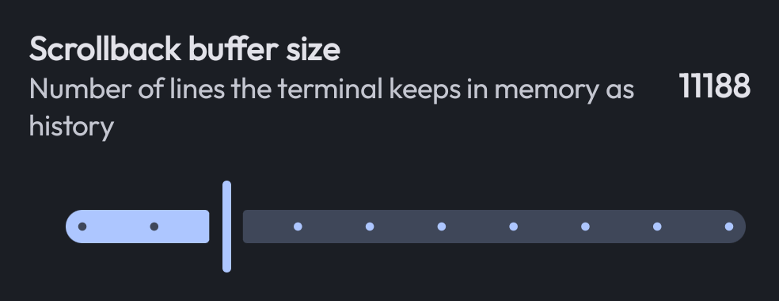

# Settings Components

Building a settings UI can be repetitive. Xed-Editor provides a collection of pre-made components
that match the app's look and feel while reducing the amount of code you need to write.

## Base Components

These are low-level components used to structure your settings layout.

### PreferenceLayout

The top-level container for any settings screen. It handles the scrolling and the top app bar.

```kotlin
PreferenceLayout(label = "My settings", backArrowVisible = true) {
    // Content goes here
}
```

### PreferenceGroup

Groups related settings together with an optional heading. It also adds a nice
background around the items.

```kotlin
PreferenceGroup(heading = "Appearance") {
    // Settings items go here
}
```

### PreferenceTemplate

A generic template for creating custom settings items. It provides slots for icons, titles, and
descriptions. You should only use this if the other components don't fit your needs.

## Common Components

These components provide more functionality with less boilerplate and are used throughout the app.

### SettingsItem

This is the most versatile component. It can be a clickable item or a toggle switch.

```kotlin
SettingsItem(
    label = "Enable advanced mode",
    description = "Shows more options in the menu",
    default = MySettings.advancedMode,
    sideEffect = { MySettings.advancedMode = it }
)
```

If you set `showSwitch = false`, it becomes a simple clickable item:

```kotlin
SettingsItem(
    label = "Clear cache",
    description = "Remove all cached files",
    showSwitch = false,
    onClick = { /* Clear logic */ }
)
```

### EditorSettingsItem

A specialized version of `SettingsItem` that automatically refreshes the editor when the value
changes. Use this for anything that affects the code editor's appearance or behavior.

```kotlin
EditorSettingsItem(
    label = "Show line numbers",
    default = MySettings.showLineNumbers,
    sideEffect = { MySettings.showLineNumbers = it }
)
```

### InfoBlock

Displays a highlighted block of information or a warning. It's great for explaining complex settings
or giving tips.

```kotlin
InfoBlock(
    text = "The following settings are experimental.",
    warning = true,
    icon = { Icon(Icons.Default.Warning, null) }
)
```

### NextScreenCard

A card that navigates to another settings screen when clicked. It automatically adds a "chevron"icon
at the end to indicate navigation.

```kotlin
NextScreenCard(
    label = "Editor font",
    description = "Change the font used in the code editor",
    route = "font_settings",
)
```

### PreferenceList

Shows a [Settings item](#settingsitem) that opens a dialog with a list of options. The user can
select
exactly one item.

The `items` argument should be a list of pairs, where the first element is the value that will be
used
to call `onItemSelected` and the second element is the text that will be displayed in the list.

```kotlin
PreferenceList(
    label = "Line ending",
    description = "Change the line ending used in files",
    items = listOf("LF" to "LF (Unix)", "CRLF" to "CRLF (Windows)", "CR" to "CR (Mac)"),
    selectedItem = MySettings.lineEnding,
    onItemSelected = { MySettings.lineEnding = it }
)
```

### PreferenceSingleInput

Shows a [Settings item](#settingsitem) that opens a dialog with a single text input field. Perfect
for names, URLs, or other short strings.

```kotlin
PreferenceSingleInput(
    label = "Author name",
    description = "The name shown in your commits",
    value = MySettings.author,
    onConfirm = { MySettings.author = it },
    validate = { it.isNotBlank() },
    // ...
)
```

### SingleInputDialog / DoubleInputDialog

`SingleInputDialog` is internally used by `PreferenceSingleInput`. In most cases you should
use it instead because it is more convenient.

The `DoubleInputDialog` is a variant of the `SingleInputDialog` that asks for two values at once.
There is no convenient `PreferenceDoubleInput`, therefore you have to manually create this dialog:

```kotlin
DoubleInputDialog(
    title = "Server configuration",
    firstInputLabel = "Host",
    firstInputValue = host,
    onFirstInputValueChange = { host = it },
    secondInputLabel = "Port",
    secondInputValue = port,
    onSecondInputValueChange = { port = it },
    onConfirm = { /* Save logic */ }
)
```

These two dialogs have many more options than shown here, like showing error messages or changing
the button text.

## Value Sliders

Sliders are perfect for numeric settings like font size or opacity. Xed-Editor provides three
specialized variants to handle different behaviors.

### SmoothValueSlider


A standard slider that will behave continuously between the minimum and maximum values. Use this for
settings that have a high range of values.



```kotlin
SmoothValueSlider(
    label = "Text size",
    description = "Set text size",
    min = 6,
    max = 50,
    default = MySettings.fontSize,
    onValueChanged = { MySettings.fontSize = it }
)
```

### SteppedValueSlider

Moves in discrete steps. This is useful when you want to restrict the user to specific values (e.g.,
only even numbers).



```kotlin
SteppedValueSlider(
    label = "Tab size",
    description = "Number of spaces per tab",
    min = 1,
    max = 16,
    stepSize = 1,
    default = MySettings.tabSize,
    onValueChanged = { MySettings.tabSize = it }
)
```

### RoundedValueSlider

Similar to the stepped slider, but it automatically rounds the minimum value down to a clean power-of-10 boundary.
This creates a "cleaner" visual scale when working with large ranges that can't be represented linearly.



```kotlin
RoundedValueSlider(
    label = "Scrollback buffer size",
    description = "Number of lines the terminal keeps in memory as history",
    min = 100,
    max = 50_000,
    stepSize = 5_000,
    default = MySettings.scrollbackSize,
    onValueChanged = { MySettings.scrollbackSize = it }
)
```

When we would've used the `SteppedValueSlider` for the above example, fraction numbers would have been visible:




> [!TIP]
> All sliders include a "debounce" feature, meaning the `onValueChanged` callback is only triggered
> after the user stops moving the slider for a short moment. This prevents lag when saving settings
> to disk.
