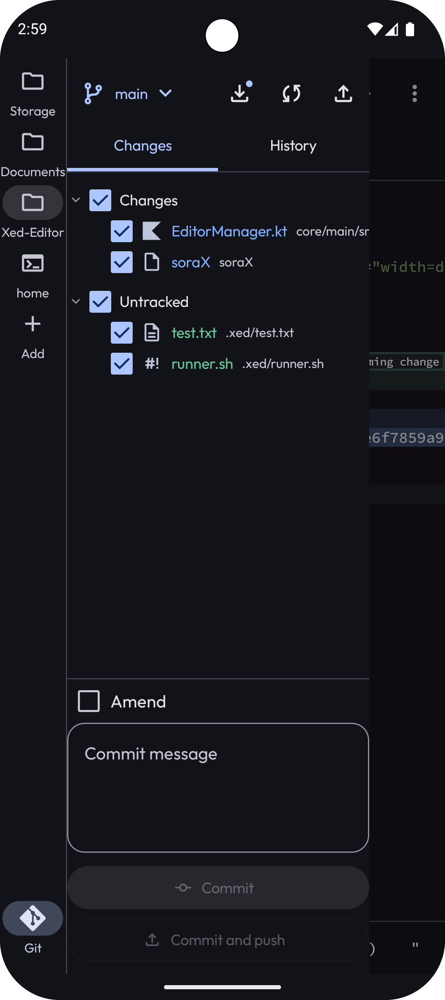
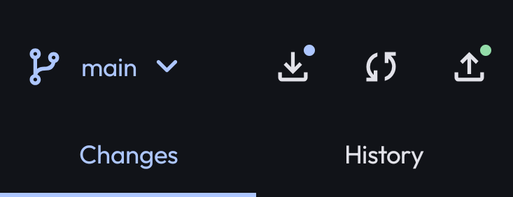
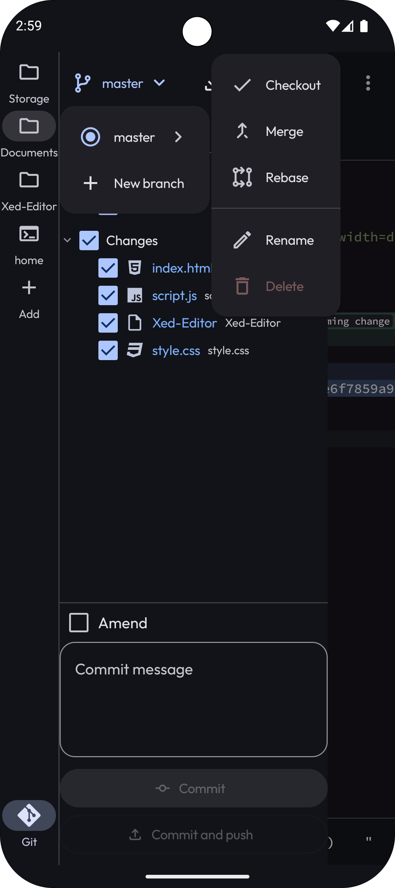
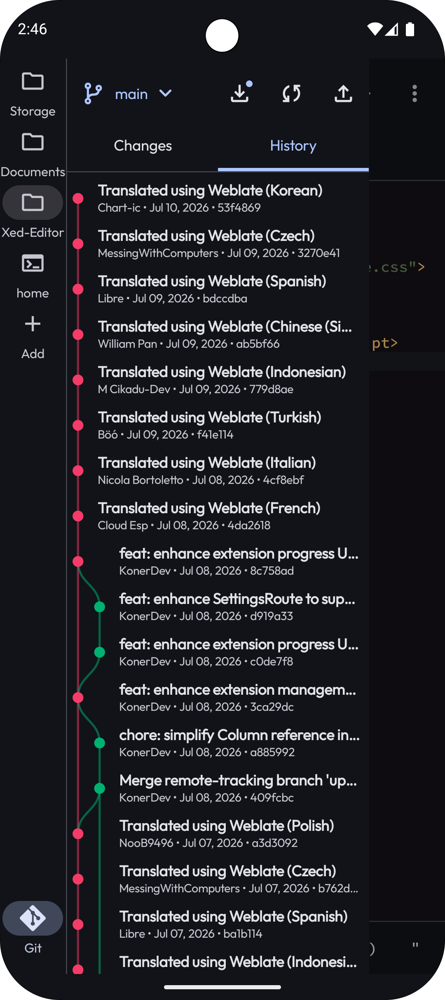
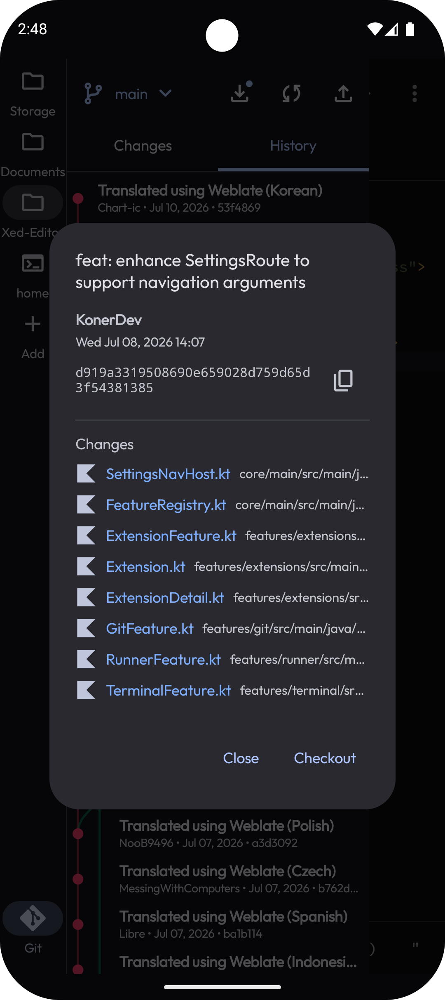
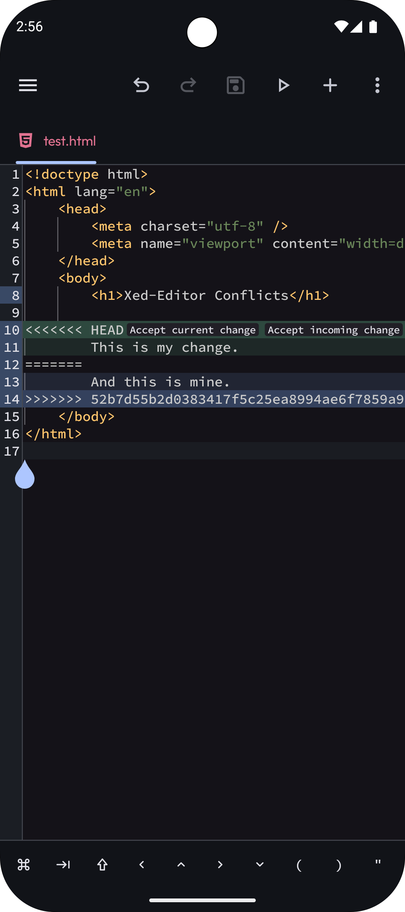

# Git Integration

Xed-Editor comes with a built-in Git client that lets you manage your source code directly within
the app. You can track changes, commit work, and sync with remote repositories like GitHub without
ever leaving the editor.

## Getting Started

To use the Git features, simply open a project folder that contains a `.git` repository. Xed-Editor
will automatically detect it and show the Git icon in the side drawer (at the bottom as a service tab).

### Configuring Your Identity

Before you make your first commit, you should tell Git who you are. This information is saved
in your commits so others know who wrote the code.

1. Go to **Settings → Git**.
2. Tap on **User data**.
3. Enter your **Name** and **Email**.

:::tip
If you are using GitHub and you don't want to expose your email address, you can obtain an anonymous `noreply` email and use it here.

👉 [**Read more about this**](https://docs.github.com/en/account-and-profile/reference/email-addresses-reference#your-noreply-email-address)
:::

### Connecting to GitHub (Credentials)

If you want to authenticate with GitHub, for example to push changes or access private repositories,
you need to configure your credentials.

1. In **Settings > Git**, tap on **Credentials**.
2. Enter your **Username** (your GitHub username).
3. Enter your **Personal Access Token (PAT)**.

If you don't know how to create a **PAT**, check out
this [guide](https://docs.github.com/en/authentication/keeping-your-account-and-data-secure/managing-your-personal-access-tokens#creating-a-personal-access-token-classic).

::: warning IMPORTANT
GitHub no longer supports account passwords for Git over HTTPS. You have to use a **Personal Access Token (PAT)** instead.
:::

## The Git Drawer

Once a repository is detected, a new Git service tab appears in the side drawer. This is your interface
for all Git operations.

### Tracking Changes

In the **Changes** section, you can see all the files you have 
**modified**, **added**, or 
**deleted**.

Files with **conflicts** (e.g. merge conflicts) are also displayed
there.

- **View Diffs**: Tap on any file to see exactly what lines have changed compared to the last
  commit.
- **Discard Changes**: Long-press a file if you want to undo your changes and revert it to its
  previous state.
- **Staging**: Use the checkboxes next to the files to select which changes you want to include in
  your next commit.

### Committing Work

Once you have staged your changes, enter a descriptive **Commit Message** in the text box at the
bottom of the drawer.

- **Commit**: Tap the commit button to save your changes to the local history.
- **Amend**: If you made a mistake in your last commit, check the **Amend** box before committing
  again. This will merge your new changes into the previous commit instead of creating a new one.

### Toolbar Actions

At the top of the Git drawer, you will find buttons for common remote operations:

- **Pull (left)**: Download the latest changes from the remote server and merge them into your branch.
- **Push (middle)**: Upload your local commits to the remote server.
- **Fetch (right)**: Check the remote server for updates without merging them yet.

::: info
Look for small circles (badges) on the Pull and Push icons. They tell you
exactly if you are behind and/or ahead of the remote server.
:::

## Branch Management

You can manage your branches directly from the top toolbar of the Git drawer. Tap on the current
branch name to open the branch menu.

- **Create**: Tap the **+** icon to create a new branch.
- **Options**: Tap on any branch to open a submenu with more options:
  - **Checkout**: Select the option `Checkout` to switch to this branch.
  - **Rename**: Select the option `Rename` to change the name of the branch.
  - **Delete**: Select the option `Delete` remove the branch.
  - **Merge/Rebase**: You can also initiate `Merge` or `Rebase` operations from this menu to combine work
      from different branches.

## Git Graph

  
  

The **Git Graph** provides a visual history of your project. You can see how branches have evolved,
merged, and split over time.

You can open it by tapping on the **History** tab below the toolbar.

- **Commit Details**: Tap on any commit in the graph to see its full message, author, date, and a
  list of all files that were changed in that specific version.
- **Explore Changes**: Just like in the changes list, you can tap on files within the commit details
  to view their individual diffs.

## Conflict Resolution

When you pull changes from others that clash with your own work, a "merge conflict" occurs.
Xed-Editor makes resolving these easy.

1. Ensure **Conflict Detection** is enabled in **Settings → Git**.
2. When a conflict is detected, Xed-Editor will highlight the conflicting files in the drawer.
3. Open the file in the editor. You will see three special buttons that allow you to quickly choose
   between **Accept current change**, **Accept incoming change**, or **Accept both changes**.

## Additional Settings

You can further customize your Git experience in the settings:

- **Colorize Files**: If enabled, files in the drawer and the tab title will change color based on their
  Git status.
- **Gutter Indication**: Highlights the editor's line number panel to indicate which
  lines have been added, changed, or deleted.
- **Submodules**: Toggle support for Git submodules and decide if they should be updated
  recursively.
