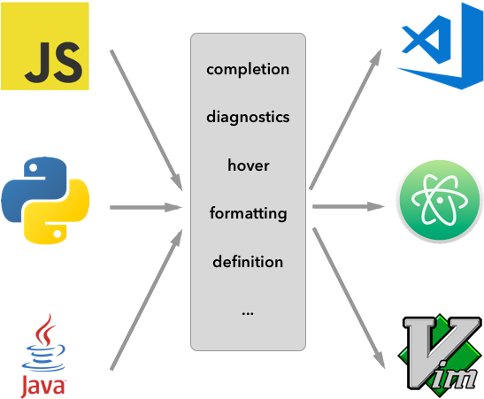

# Language Servers

A **Language Server** is a background process that provides language-specific features to the editor through the **Language Server Protocol (LSP)**.

They allow Xed-Editor to have intelligent features:

### Key Features

- **Autocomplete & IntelliSense**  
  Suggest code completions based on context, including variables, functions, and classes.

- **Diagnostics & Error Checking**  
  Highlight errors and warnings in your code in real-time.

- **Code Navigation**  
  Jump to definitions, references, and symbols across files.

- **Refactoring Support**  
  Rename symbols, extract functions, and perform other automated refactorings.

- **Hover & Documentation**  
  Display documentation when hovering over symbols.

- **Inlay Hints**  
  Show inline hints (e.g. parameters, types and color previews).

- **Formatting**  
  Allow formatting for the entire document or a portion of it.